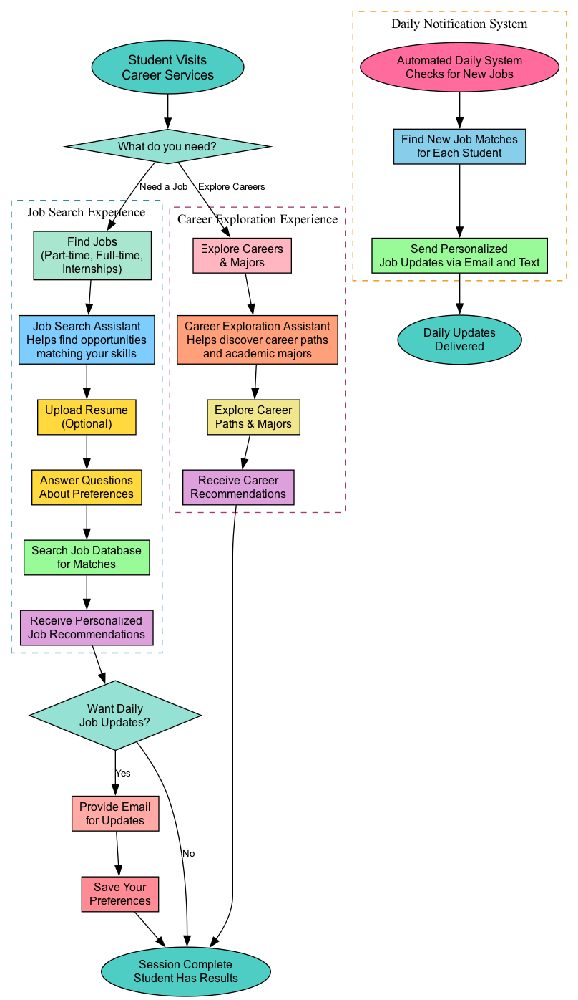

# User Flow & Journey

## Overview

This documentation describes the user journey through the AI-powered job search assistant, from initial profile setup through conversational job discovery and automated daily recommendations.

### Visual Flow Diagram


## Application Routes & User Journey

### Route Structure
The React application uses client-side routing with three main user interfaces:

- **`/` (ProfilePage)**: Initial profile setup and resume upload
- **`/job-options` (JobOptionsPage)**: Job search category selection
- **`/chatbot` (ChatBotPage)**: AI-powered conversational interface

### User Experience Flow

#### 1. Profile Setup (`/`)
**Initial onboarding and profile creation**
- **Resume Upload**: Optional AI-powered resume parsing using AWS Bedrock Nova Pro
- **Profile Form**: Personal information, education, experience, job preferences
- **Notification Settings**: Opt-in for daily job alerts via email/SMS
- **Data Storage**: Profile saved to DynamoDB with email as primary key
- **Navigation**: Proceeds to job options after successful profile save

#### 2. Job Search Options (`/job-options`)
**Category selection for targeted job search**
- **Part-time Jobs**: Student-friendly flexible positions
- **Full-time & Internships**: Career-focused opportunities
- **Career Exploration**: Guidance on career paths and majors
- **Context Passing**: User preferences carried to chat interface
- **Navigation**: All options lead to the chatbot with appropriate context

#### 3. AI Chat Interface (`/chatbot`)
**Conversational job search and career guidance**
- **Multi-Agent System**: Intelligent routing between job search and career advice
- **Natural Language Queries**: Ask questions like "Find software engineering internships" or "How do I prepare for coding interviews?"
- **Personalized Results**: Job recommendations based on profile, preferences, and conversation history
- **Interactive Job Cards**: Clickable job results with detailed descriptions and fit analysis
- **Career Advice**: Professional development guidance with source citations
- **Memory Integration**: Conversation continuity across sessions
- **Profile Access**: Easy navigation back to update profile information

## AI Agent System (User Perspective)

### How the AI Agents Work for Users

#### Orchestrator Agent
- **Smart Routing**: Automatically understands if you're asking about jobs or career advice
- **Context Awareness**: Remembers your profile details and previous conversations
- **Personalization**: Tailors responses based on your career level and interests

#### Job Search Agent
- **Intelligent Matching**: Finds jobs that match your skills, experience, and preferences
- **Real-time Search**: Immediate results as you chat
- **Fit Analysis**: Explains why each job might be a good match for you
- **Diverse Opportunities**: Searches across different job types and locations

#### Career Advice Agent
- **Expert Guidance**: Provides career development tips and industry insights
- **Source Citations**: Links to helpful articles and resources
- **Personalized Advice**: Tailored recommendations based on your career goals
- **Long-term Memory**: Builds on previous career conversations

### Memory & Personalization Features

#### Conversation Continuity
- **Session Memory**: Remembers your conversation within each chat session
- **Long-term Memory**: Remembers your preferences and past interactions across sessions
- **Profile Integration**: Uses your resume data and stated preferences for better recommendations

#### Automated Daily Job Matching
- **Background Processing**: Daily job searches run automatically while you sleep
- **Personalized Alerts**: Email notifications with jobs matching your criteria
- **Smart Filtering**: Avoids sending duplicate or irrelevant recommendations

## User Benefits & Features

### For Students
- **Easy Job Discovery**: Natural language search instead of complex filters
- **Career Guidance**: Access to professional advice and resources
- **Skill Development**: Resume analysis and improvement suggestions
- **Time Saving**: Automated daily job matching reduces manual searching

### For Job Seekers
- **Personalized Results**: Recommendations based on your unique profile
- **Comprehensive Coverage**: Jobs, internships, and career advice in one place
- **Professional Support**: AI-powered guidance for career development
- **Flexible Communication**: Chat anytime, receive daily email summaries

## User Flow Diagram

The application follows this high-level user journey:

```
User Visits App
    ↓
Profile Setup (/profile)
├── Resume Upload (Optional)
├── Personal Information
└── Job Preferences
    ↓
Job Category Selection (/job-options)
├── Part-time Jobs
├── Full-time & Internships
└── Career Exploration
    ↓
AI Chat Interface (/chatbot)
├── Natural Language Queries
├── Personalized Job Results
├── Career Advice & Guidance
└── Interactive Job Details
    ↓
Automated Daily Processing
├── Background Job Matching
├── Email Notifications
└── SMS Alerts (Optional)
```

## Files
- `user_flow.dot` - Graphviz source file for the flow diagram
- `user_flow.png` - Generated PNG image of the user flow diagram

## Generate Image
```bash
dot -Tpng user_flow.dot -o user_flow.png
```